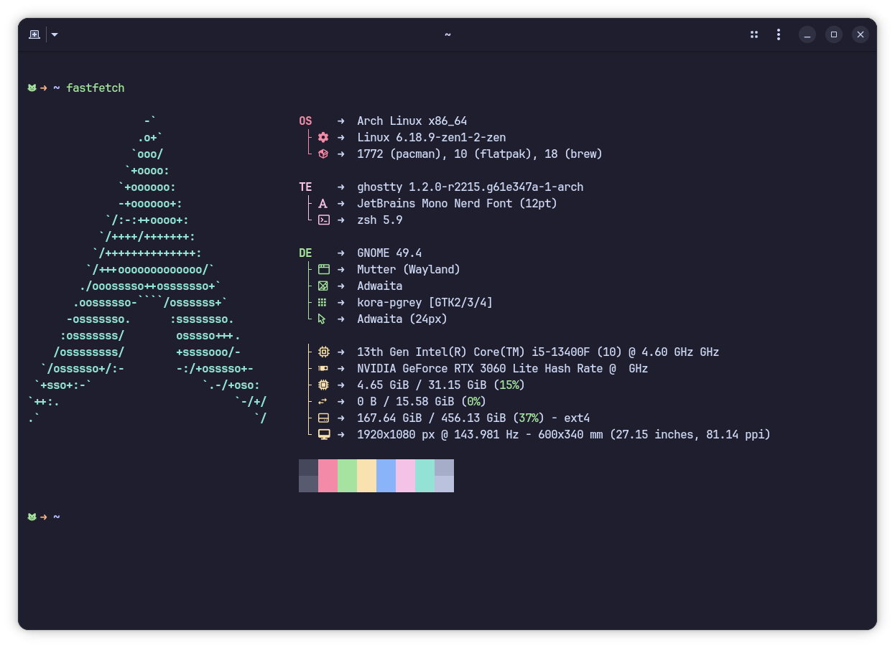
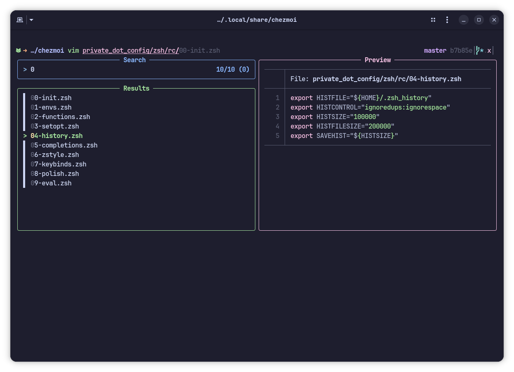
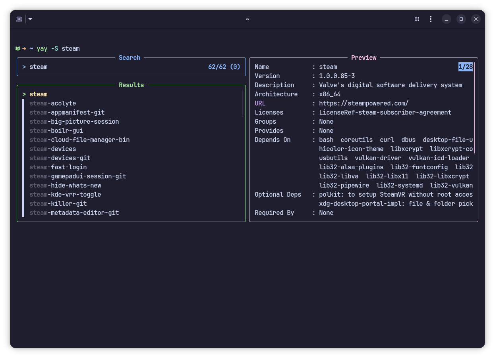

# My personal dotfiles

## Previews

Fastfetch ofc

Fzf-tab with preview

Fzf-tab for yay

Just random lt alias output

## 🚀 Zsh setup:

- ⌨️ Emacs mode _(for people without mental diseases)_ with ctrl + arrows, home/end buttons and ctrl+backspace/del
- 🛠️ A bunch of useful plugins managed with Zinit
  - zsh-completions
  - zsh-autosuggestions
  - fzf-tab
  - zsh-autopair
  - zsh-you-should-use
  - fast-syntax-highlighting
- 🪄 Some ~~I use~~ Arch ~~btw~~ polishing (like package info in fzf-tab when using Yay)

## 📦 Packages used:

- **starship** - minimalistic shell prompt
- **eza** - ls on steroids (like files icons)
- **bat** - cat on steroids
- **atuin** - upgrades your up arrow key
- **lazygit** - TUI for git
- **thefuck** - corrects your mistakes
- **ghostty terminal** - just terminal
